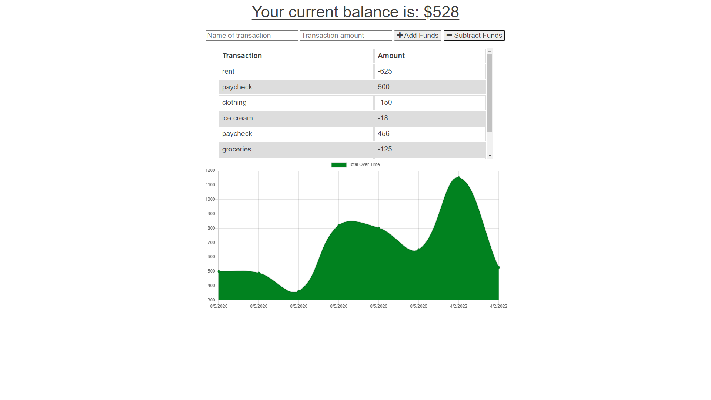

# Project Title

  Budget Tracker

  
  
---

## Table of Contents:
  - [Description](#description)
  - [User-Story](#user-story)
  - [Screenshot](#screenshot)
  - [Deployment](#deployment)
  - [Installation](#installation) 
  - [License](#license)
  - [Contributing](#contribution)
  - [Questions](#contact-information)

---

  ## Description

  A progressive-web-app to keep an account balance even while offline. A user will be able to add expenses and deposits to their budget with or without an internet connection. As an existing application, my job was to enable off-line functionality by creating and connecting a manifest and a service-worker, and also to deploy to Heroku and connect to a MongoDB database.

  Offline Functionality:

    * Enter deposits offline

    * Enter expenses offline

  When brought back online:

    * Offline entries should be added to tracker.

  ---

  ## User Story
    AS AN avid traveller
    I WANT to be able to track my withdrawals and deposits with or without a data/internet connection
    SO THAT my account balance is accurate when I am traveling

  ---

  ## Screenshot
  
  

  ---

  ## Deployment

  [Live site can be viewed here.](https://glacial-inlet-81056.herokuapp.com/)

  ---

  ## Installation

  The app can be installed by going to https://glacial-inlet-81056.herokuapp.com/ and clicking the install app element in the address window.

---

  ## License
  
  

  * For more information on license types, please reference this website
  for additional licensing information - [https: //choosealicense.com/](https://choosealicense.com/).
---

  ## Contributing

  Not accepting contributions.

---

  ## Contact Information:
  * GitHub Username: [jfisher396](https://github.com/jfisher396)
  * Contact Email: james@james-fisher-web-developer.com
  
